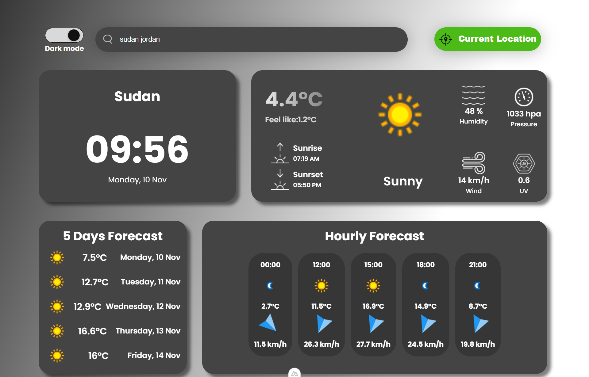
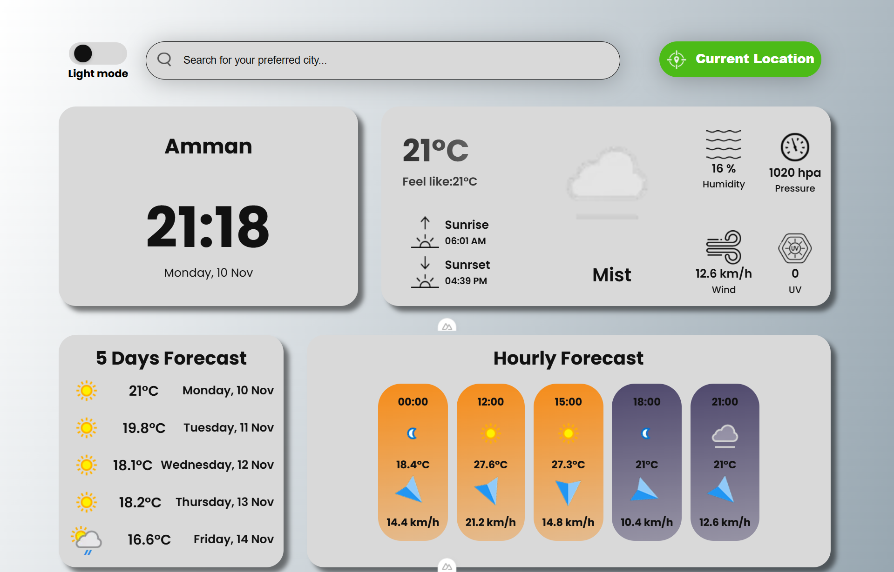
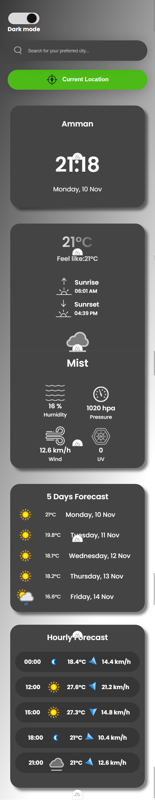
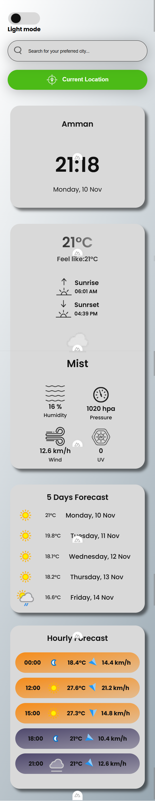
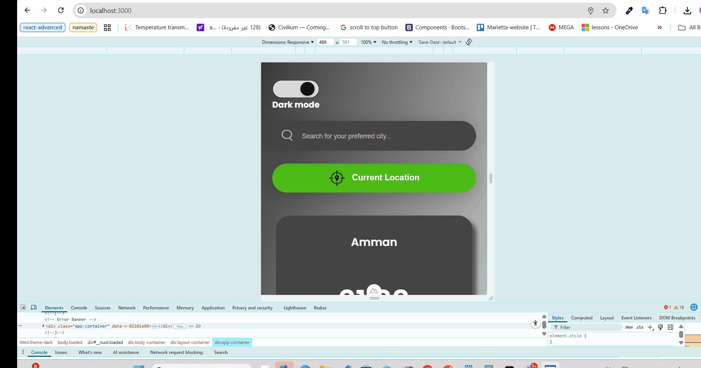

# Vue Weather App

A modern weather application built with Vue 3, TypeScript, and Pinia that allows users to view current weather, 5-day forecasts, hourly weather data, and search for any city. It also provides the user's current location weather data with a single click.

---

## 📦 Tech Stack

- **Frontend:** Vue 3, TypeScript, HTML, CSS, JavaScript
- **State Management:** Pinia
- **APIs:** weatherapi.com
- **Deployed link:**

---

## ⚡ Features Implemented

- Display **current weather data** for any city
- Display **5-day weather forecast**
- Display **hourly weather data**
- **Search functionality** for cities
- **Get current location weather** using geolocation API

### Extra Features

- **Theme toggle** (light/dark)
- **Skeleton loaders** for smooth loading experience
- **Loading spinners** during API calls
- **Transition animations** for better UI experience
- Fully written in **TypeScript**

---

## 🚀 Setup Instructions

1. **Clone the repository**

```bash
git clone git@github.com:Ahmed-Alanaswah/weather-dashboard.git
or
git clone https://github.com/Ahmed-Alanaswah/weather-dashboard.git
```

2. **navigate to repository**

```bash
cd weather-dashboard
```

3. **Install dependencies**

```bash
npm install
```

4. **Run the development server**

```bash
npm run dev
```

5. **Open your browser** at http://localhost:3000 (or the port displayed in terminal)

6. **Environment Variables** Create a .env file in the root directory and add your weather API key:

```bash
WEATHERAPI_KEY=your_api_key_here
```

## 📸 Screenshots

### Desktop screen dark



### Desktop screen light



### Mobile screen dark



### Mobile screen light



## 🎥 Demo



